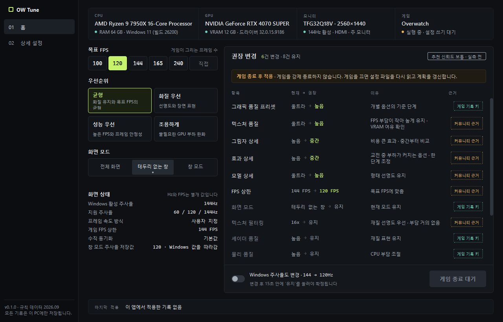
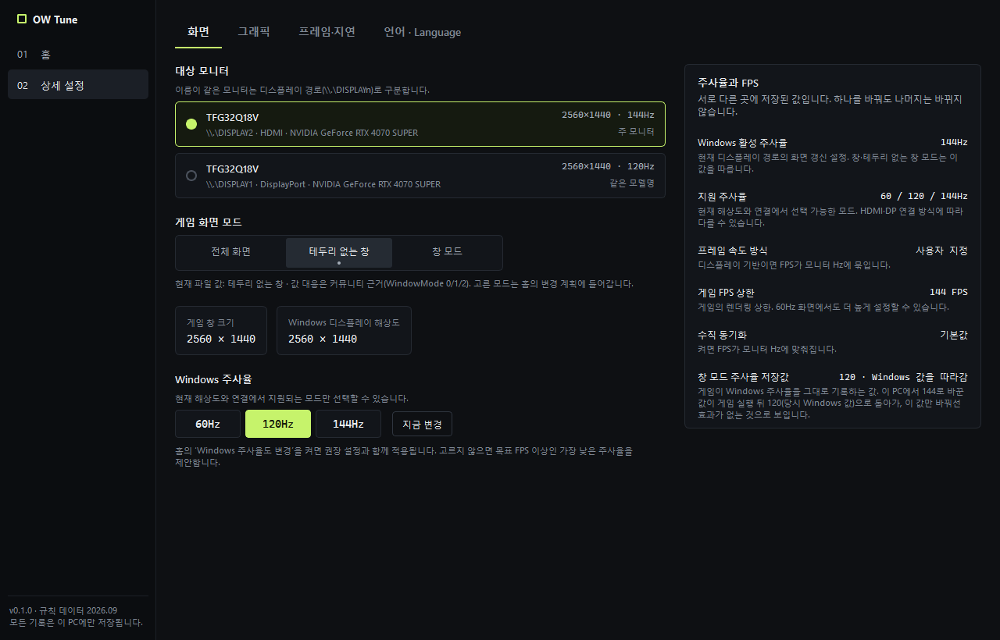
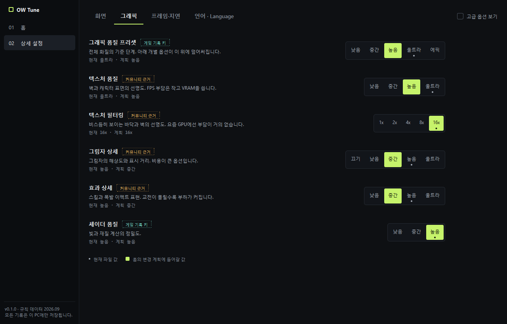
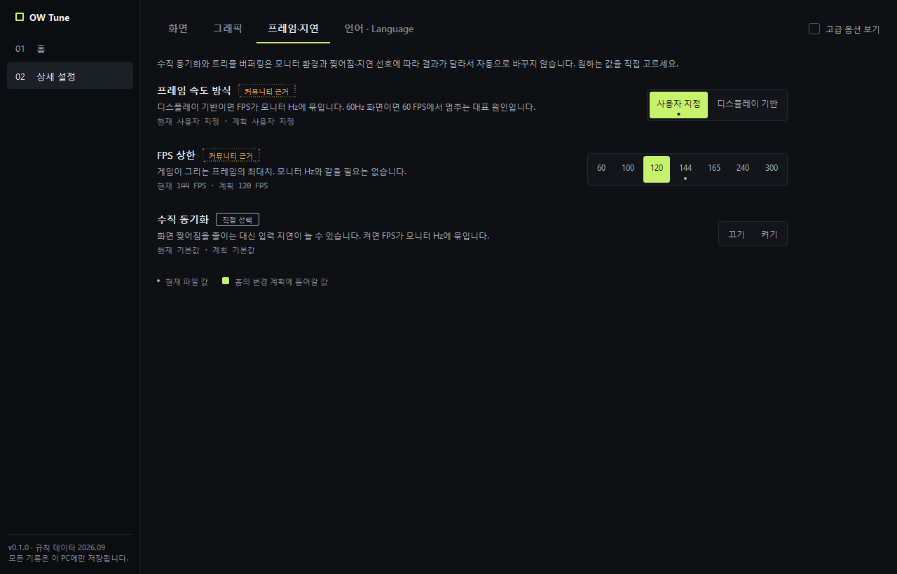
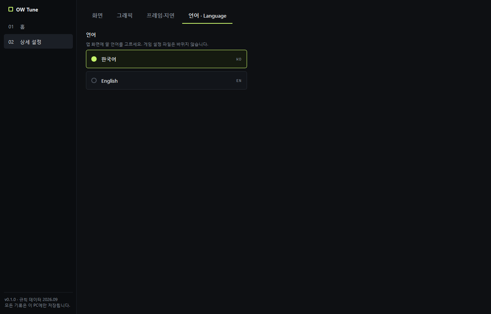
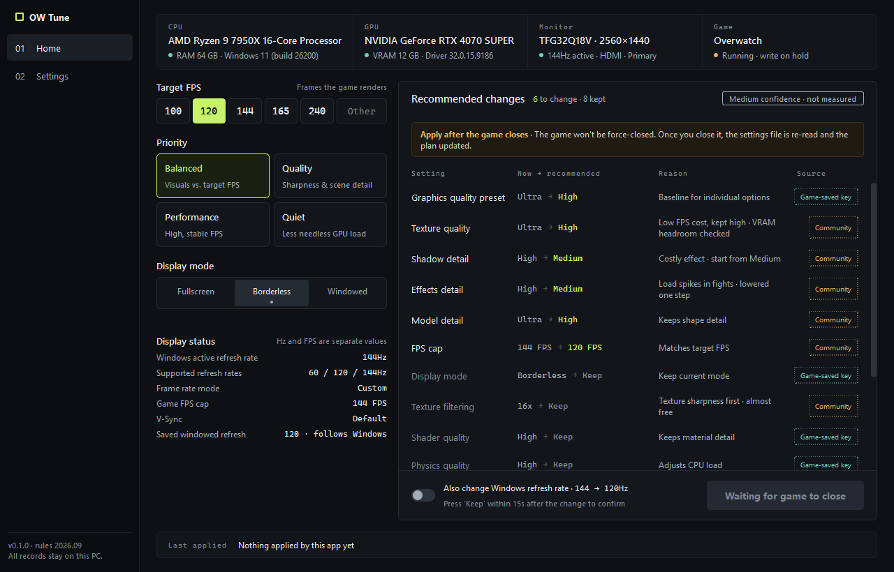

# OW Tune

오버워치 그래픽 설정과 Windows 모니터 주사율을 한 화면에서 보고, **원클릭으로 PC에 맞는 권장 설정을 적용**하는 Windows 데스크톱 앱.



> 스크린샷은 빌드한 `OWTune.exe`를 직접 실행해서 찍은 화면이다. 찍을 때 오버워치가 켜져 있어서 적용 버튼이 `게임 종료 대기`로 잠겨 있다(아래 [안전장치](#안전장치) 참고).

## 다운로드·실행

1. [Releases](https://github.com/AIProject-k/Overwatch_Optimizer/releases/latest)에서 `OWTune.exe`를 받는다.
2. 더블클릭하면 끝. Python 설치 필요 없음(Windows 10/11 64비트).

코드 서명이 없는 exe라 처음 실행할 때 Windows SmartScreen이 `Windows의 PC 보호` 창을 띄울 수 있다. `추가 정보` → `실행`을 누르면 된다.

## 왜 만들었나

"창 모드에서 FPS가 60에서 안 올라간다"는 문제에서 출발했다. 원인이 될 수 있는 값이 여기저기 흩어져 있어서 찾기 어렵다.

- Windows 모니터 주사율(Hz) — Windows 디스플레이 설정
- 게임 FPS 상한·프레임 속도 방식·수직 동기화 — 오버워치 설정 파일
- 그래픽 품질 옵션 — 오버워치 설정 파일

OW Tune은 이걸 한곳에 모아 보여주고, **Hz(모니터가 화면을 새로 그리는 횟수)와 FPS(게임이 그림을 만드는 횟수)를 따로** 다룬다.

## 화면 설명

### 01 홈


| 영역 | 하는 일 |
|---|---|
| 맨 위 요약 줄 | CPU·RAM·OS, 게임이 쓰는 GPU·VRAM·드라이버, 대상 모니터(해상도·주사율·HDMI/DP 연결), 게임 실행 상태. 읽지 못한 값은 `미확인`으로 둔다 |
| 목표 FPS | 100·120·144·165·240 버튼 또는 `직접` 칸에 30~600 입력 |
| 우선순위 | 균형 / 화질 우선 / 성능 우선 / 조용하게(모니터 Hz 이상은 안 그림) |
| 화면 모드 | 전체 화면 / 테두리 없는 창 / 창 모드. 아래 작은 점이 지금 파일 값 |
| 화면 상태 | Windows 주사율, 지원 주사율, 프레임 속도 방식, FPS 상한, 수직 동기화. **노란 값은 FPS를 모니터 Hz에 묶을 수 있는 설정**(60 FPS 고정 원인 후보) |
| 권장 변경 표 | 항목마다 `현재 → 권장`, 이유, 근거 배지. 바뀌는 항목이 위, `유지` 항목은 흐리게 아래 |
| Windows 주사율도 변경 | 켜면 권장 설정과 함께 모니터 주사율도 바꾼다. 바꾼 뒤 15초 안에 `유지`를 안 누르면 원래대로 |
| 권장 설정 적용 | 한 번 누르면 백업 → 저장 → 다시 읽어 확인까지 한 번에 |
| 마지막 적용 | 언제 무엇을 적용했는지, 게임을 켰다 끈 뒤 값이 남았는지. `이번 변경 취소`로 되돌리기 |

### 02 상세 설정 — 화면



- **대상 모니터**: 이름이 같은 모니터도 `\\.\DISPLAYn` 경로와 연결 방식(HDMI/DisplayPort)으로 구분한다. 가상 화면(Parsec 등)은 고를 수 없다.
- **게임 화면 모드**: 여기서 고른 모드가 홈의 변경 계획에 들어간다.
- **Windows 주사율**: 이 모니터·해상도·연결에서 **지원되는 값만** 버튼으로 나온다. `지금 변경`은 게임 설정 없이 주사율만 바로 바꾼다(15초 유지 확인 포함).
- 오른쪽 **주사율과 FPS** 패널: 서로 다른 곳에 저장된 값들을 설명과 함께 보여준다.

### 02 상세 설정 — 그래픽



- 옵션마다 선택 버튼이 있다. **초록 칸 = 홈 계획에 들어갈 값**, **작은 점 = 지금 파일 값**.
- 추천과 다른 값을 고르면 `직접 지정` 배지가 붙고, 우선순위를 바꿔도 그 값은 유지된다. `직접 지정 초기화`로 되돌린다.
- `고급 옵션 보기`를 켜면 모델 상세·물리 품질·앰비언트 오클루전이 더 나온다.

### 02 상세 설정 — 프레임·지연



- **프레임 속도 방식**: `디스플레이 기반`이면 FPS가 모니터 Hz에 묶인다. 60Hz 화면에서 60 FPS에 멈추는 대표 원인이라 추천은 항상 `사용자 지정`.
- **FPS 상한**: 목표 FPS에 맞춘다. 모니터 Hz와 같을 필요는 없다.
- **수직 동기화·트리플 버퍼링**: 찢어짐과 입력 지연 중 뭘 참을지는 취향이라 **자동으로 안 바꾼다**. 원하면 여기서 직접 고른다.

### 02 상세 설정 — 언어 · Language



한국어 / English 전환. 누르면 바로 바뀌고 다음 실행에도 기억한다. 탭 이름은 어느 언어로 보고 있든 찾을 수 있게 두 언어를 같이 쓴다.



## 사용 순서

1. 홈에서 목표 FPS와 우선순위를 고른다.
2. `권장 변경` 표를 확인한다. 필요하면 상세 설정에서 옵션을 직접 고친다.
3. 모니터 주사율도 올리려면 `Windows 주사율도 변경`을 켠다.
4. 오버워치를 끈 상태에서 `권장 설정 적용`.
5. 오버워치를 한 번 실행했다가 끄면, 홈 하단에 `게임 저장 후 유지 N/M`처럼 적용한 값이 남았는지 나온다.

## 안전장치

| 상황 | 동작 |
|---|---|
| 게임 실행 중 | 설정 파일을 쓰지 않고 `게임 종료 대기`. 게임을 강제 종료하지 않는다. 게임을 끄면 파일을 다시 읽고 계획을 갱신 |
| 계획을 만든 뒤 파일이 바뀜 | 오래된 계획은 적용하지 않고 새로 만든다 |
| 파일 쓰기 | 바꿀 줄만 고친다. CRLF 줄바꿈·다른 섹션·키 순서 보존. 새 키는 게임과 같은 정렬 위치에 넣는다. 중복 키·섹션이 있으면 멈춤 |
| 쓰기 전 | 자동 백업 `%LOCALAPPDATA%\OWTune\backups\` (최초 원본 + 최근 10개). 백업이 실패하면 쓰지 않음 |
| 되돌리기 | `이번 변경 취소`는 이번에 쓴 키만 이전 값으로. 그사이 게임이 저장한 다른 설정은 그대로 |
| 주사율 변경 | 사전 검사(`CDS_TEST`) → 적용 → 15초 안에 `유지`. 앱이 멈춰도 별도 감시 프로세스가 20초 뒤 원래대로 되돌림 |

앱이 바꾸는 건 **오버워치 설정 파일, 모니터 주사율, 앱 자기 폴더(`%LOCALAPPDATA%\OWTune`)** 세 가지뿐이다. 소리·드라이버·Windows 서비스는 건드리지 않고, 레지스트리도 직접 쓰지 않는다(사양 조회용으로 읽기만 하고, 주사율은 Windows 디스플레이 API로 바꾼다).

## 설정 키의 근거

오버워치 설정 화면의 옵션이 파일에서 어떤 키·값인지는 블리자드가 공개하지 않는다. 그래서 옵션마다 근거 배지를 단다.

| 배지 | 뜻 |
|---|---|
| 게임 기록 키 | 게임이 설정 파일에 직접 저장하는 걸 확인한 키(`GFXPresetLevel`, `ShaderQuality`, `WindowMode` 등). 값의 의미는 커뮤니티 근거 |
| 커뮤니티 근거 | 커뮤니티 게시물로만 알려진 키(`FrameRateCap`, `LimitToRefresh`, `TextureDetail` 등) |
| 유지 확인 | 이 PC에서 적용 후 게임이 파일을 다시 저장했을 때도 값이 남은 키 |
| 직접 지정 / 직접 선택 | 사용자가 고른 값 / 자동으로 안 바꾸는 옵션 |

게임이 다시 저장하면서 지운 키는 홈 하단에 `게임이 지움 N`으로 나온다(기본값이라 안 적었거나 게임이 모르는 키).

## 장치별 추천 방식

켤 때마다 GPU·VRAM·모니터를 새로 읽고, GPU를 [등급표](owtune/data/gpu_tiers.json)로 상·중·하로 나눠 부담 큰 옵션(프리셋·그림자·효과·모델)을 등급만큼 낮춘다. 텍스처는 VRAM 크기로 상한을 둔다(6GB 미만 중간, 8GB 미만 높음).

| `균형` 기준 | RTX 4070 SUPER (12GB) | RTX 4060 (8GB) | GTX 1650 (4GB) |
|---|---|---|---|
| 프리셋 | 높음 | 중간 | 낮음 |
| 텍스처 | 높음 | 높음 | 중간 |
| 그림자 | 중간 | 낮음 | 끄기 |
| 효과 | 중간 | 낮음 | 낮음 |

등급표에 없는 GPU는 한 단계 보수적으로 잡고 `추천 신뢰도 낮음`을 띄운다. 예상 FPS 숫자는 만들어 내지 않는다.

**아직 못 하는 것**: 해상도(1080p/4K)와 CPU는 추천에 반영하지 않는다. 목표 FPS도 모니터에 맞춰 자동으로 고르지 않는다. 게임을 직접 돌려 FPS를 재는 기능은 없다.

## 소스로 실행·빌드

```bash
python -m venv .venv
.venv\Scripts\python.exe -m pip install -r requirements.txt -r requirements-dev.txt
.venv\Scripts\python.exe -m owtune
```

`OW Tune 실행.bat`을 더블클릭해도 된다(처음 한 번 가상환경을 만든다).

테스트:

```bash
.venv\Scripts\python.exe -m pytest -q tests
```

exe 빌드(`dist\OWTune.exe` 생성):

```bash
.venv\Scripts\pyinstaller.exe --noconfirm --clean OWTune.spec
```

실제 게임 파일 대신 사본으로 시험하려면 환경 변수 `OWTUNE_SETTINGS`(설정 파일 경로)와 `OWTUNE_HOME`(앱 데이터 폴더)을 지정한다.

## 구조

| 경로 | 책임 |
|---|---|
| `owtune/ow_config.py` | 설정 파일 찾기·읽기, 줄 단위 최소 편집, 게임 실행 감지 |
| `owtune/system_probe.py` | CPU·RAM·OS·GPU 조회(레지스트리 읽기) |
| `owtune/display_service.py` | 모니터·지원 주사율·연결 방식 조회(CCD API), 주사율 변경, 복구 감시 프로세스 |
| `owtune/recommender.py` | 사양·목표·현재 값 → 변경 계획(쓰기 권한 없음) |
| `owtune/apply_service.py` | 백업·충돌 검사·원자적 교체·재읽기·되돌리기·게임 반영 확인 |
| `owtune/i18n.py`, `owtune/data/en.json` | 한국어 원문 → 영어 번역. `tests/test_i18n.py`가 빠진 번역을 잡는다 |
| `owtune/data/options.json` | 옵션 ↔ 파일 키·값 대응, 근거 등급, 우선순위별 추천값 |
| `owtune/ui/` | PySide6 화면(홈·상세 설정) |

기획 문서: [Overwatch_Optimizer_기획서.md](Overwatch_Optimizer_기획서.md)

---

## English

**OW Tune** is a Windows desktop app that shows Overwatch graphics settings and the Windows monitor refresh rate in one place, and applies PC-appropriate recommended settings in one click.

- **Download**: grab `OWTune.exe` from [Releases](https://github.com/AIProject-k/Overwatch_Optimizer/releases/latest) and run it. No Python needed.
- **Language**: switch between 한국어 and English in `Settings → 언어 · Language`.
- **Safety**: it never writes while the game is running. It backs up before every write, changes only the lines it needs, and can undo just the keys it wrote. Refresh-rate changes revert automatically unless you press `Keep` within 15 s.
- **Honesty about keys**: Blizzard doesn't document the settings-file keys, so every option carries a source badge (game-saved / community / confirmed-kept). After you run the game once, the app shows which written values survived.
